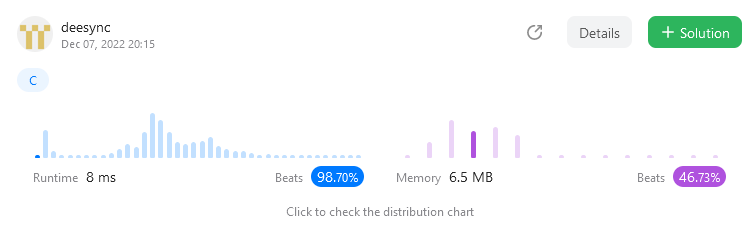
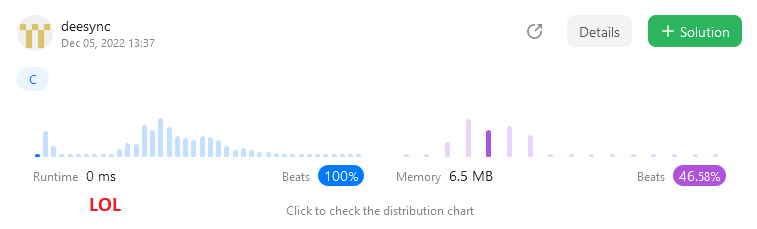

#### This is my first try on leetcode.com

The most popular task called twosum.
Here is the [description](https://leetcode.com/problems/two-sum/description/)

Solution written in C using linked list to obtain O(nlogn) time complexity

The average runtime is about 4-12 ms which is pretty fast according to leetcode statistics. 

Sometimes could be less (down to 0 ms) because of not-very-random nature of filling data by leetcode for processing could make funny results. 
As I understand it is trying to place 2 pairing members on very beginnig and on very end of the array. 

Btw memory consumption is strange. It should be really low, especially for cases when linked list are small (cases where a pair is found early).

