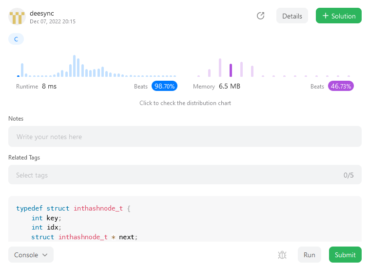
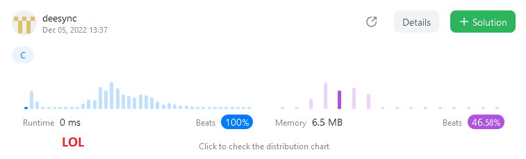

#### This is my first try on leetcode.com

The most popular task called twosum.
Here is the [description](https://leetcode.com/problems/two-sum/description/)

Solution written in C with own hash implementation

The average runtime is about 8-12 ms which is pretty fast according to leetcode statistics

But (imo) not-very-random nature of filling data by leetcode for processing could make funny results
As I understand it is trying to place 2 pairing members on very beginnig and on very end of the array
This is runtime by early code w/o freeing memory

